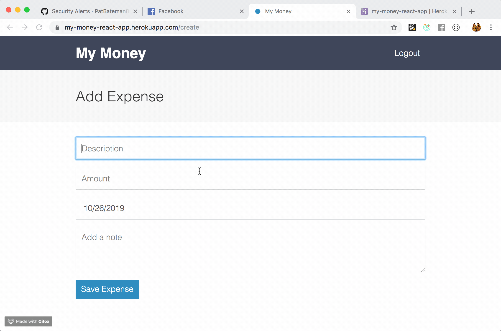

My Money React Web App.  A budgeting app connected to firebase servers allowing users to track their spending habits throughout the year.  

__[Live Demo](https://my-money-react-app.herokuapp.com)__

# Git Commands

After cloning the project
1. npm install
2. npm run dev-server
3. set up firebase account
4. in env file
    FIREBASE_API_KEY= "your firebase info"
    FIREBASE_AUTH_DOMAIN= "your firebase info"
    FIREBASE_DATABASE_URL= "your firebase info"
    FIREBASE_PROJECT_ID=my= "your firebase info"
    FIREBASE_STORAGE_BUCKET= "your firebase info"
    FIREBASE_MESSAGING_SENDER_ID= "your firebase info"
